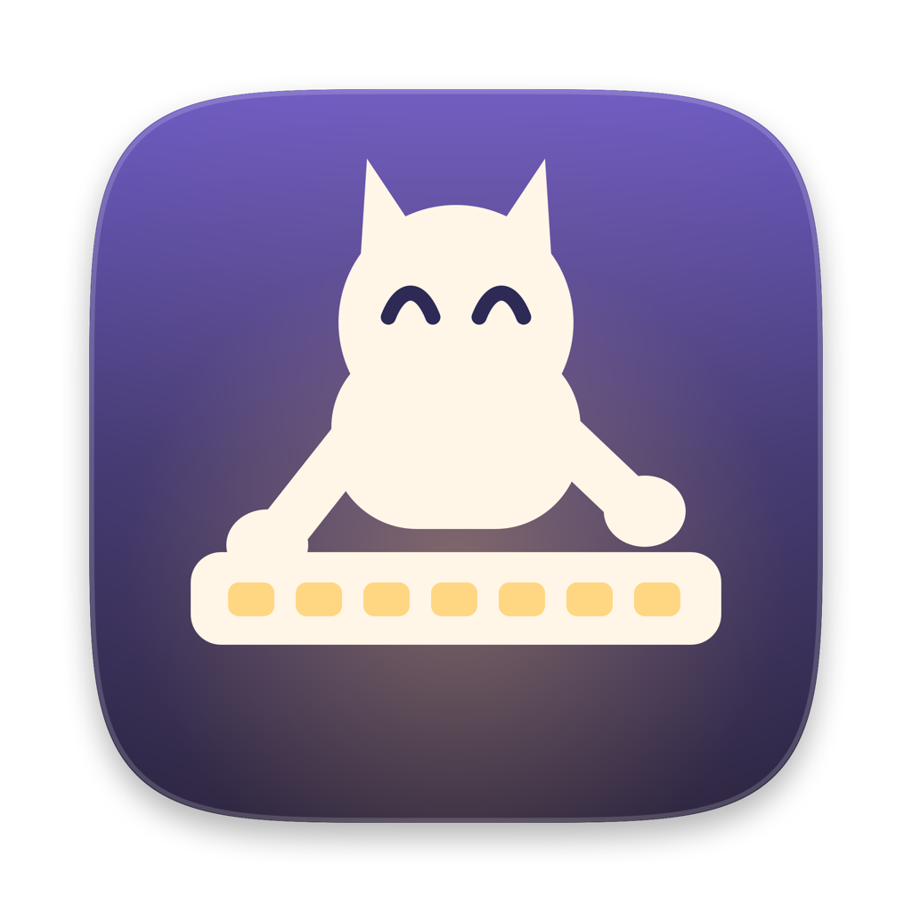
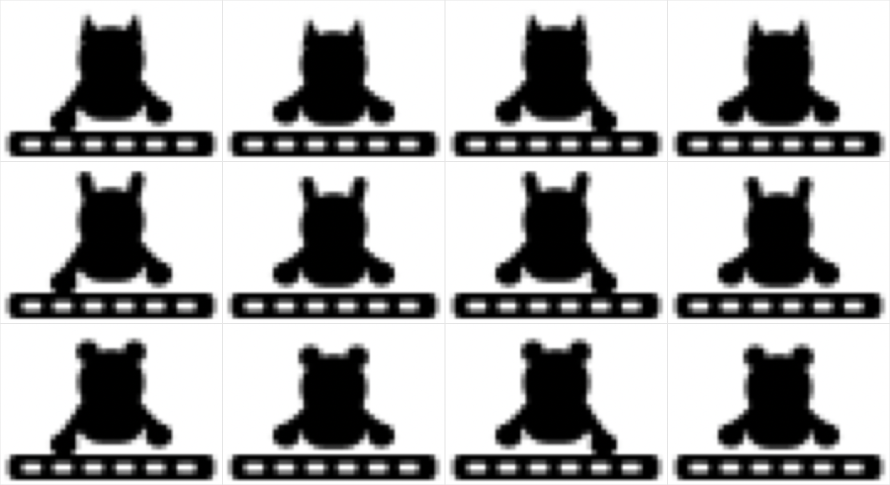

<p align="center">
  
</p>

<h1 align="center">MacAwake</h1>

<p align="center">
  <a href="https://github.com/qijieinnet/MacAwake/actions/workflows/build.yml"></a>
  <a href="https://github.com/qijieinnet/MacAwake/releases/latest"></a>
  
  
  <a href="LICENSE"></a>
</p>

macOS 菜单栏小工具，防止 Mac 休眠。

除了常规的定时/永久防休眠，它的特色是**能识别 AI 助手正在跑任务**——Claude Code 或 Codex 在干活时自动保持唤醒，任务一结束就放手。也支持**指定服务运行时**不休眠（比如起了开发服务器让别人连）。

菜单栏上空闲时是月亮，有任务时变成一只小宠物趴在键盘上打字。

---

## 下载安装

到 [Releases](https://github.com/qijieinnet/MacAwake/releases/latest) 下载：

| 文件 | 适用机型 |
|---|---|
| `MacAwake-x.y.z-Universal.dmg` | **不确定就下这个**，Apple Silicon 和 Intel 都能跑 |
| `MacAwake-x.y.z-arm64.dmg` | 仅 Apple Silicon（M 系列），体积更小 |
| `MacAwake-x.y.z-x86_64.dmg` | 仅 Intel Mac |

需要 **macOS 13** 或更新版本。

### ⚠️ 首次打开会被系统拦住

本项目**没有 Apple 开发者账号**（$99/年），app 未经过公证。从网上下载的未公证 app 一定会被 Gatekeeper 拦截，这是正常现象，不是软件损坏。

打开 DMG，把 MacAwake 拖进「应用程序」，然后任选一种放行：

**方法一（推荐，一条命令）**

```bash
xattr -dr com.apple.quarantine /Applications/MacAwake.app
```

**方法二（图形界面）**

先双击一次 MacAwake（会弹警告，点「完成」），再到「系统设置 › 隐私与安全性」，往下找到 MacAwake 那一条，点「仍要打开」。

> macOS 15 起，右键「打开」这个老办法对未公证 app 已经无效了，只能用上面两种。

---

## 功能

### 休眠控制

- **跟随系统** / **定时休眠** / **永不休眠** / **倒计时**（15 分 ~ 8 小时，可自定义）/ **到指定时刻**
- 倒计时可在面板里 +15 分 / +1 小时续期
- 定时休眠：设一组「休眠时段」，可加多条，比如 12:00–13:00 加 21:00–次日 09:00。
  每条时段各自选每天或每周（多选星期几）
- **时段外主动保持唤醒**；时段内不再干预电源，并每秒复查——智能体会话和服务规则都空闲、
  且屏幕已锁定，就主动让 Mac 睡下去
- 时段内机器自己睡了（闲置休眠 / 合盖）也算达成，唤醒后不会再被按下去一次
- 可选同时保持屏幕常亮
- 可选到点后立即让 Mac 睡眠

### AI 助手运行时不休眠

两路信号，任一命中即保持唤醒。每个助手可独立选择，默认值按各自最可靠的那条路：

| 助手 | 默认信号 | 为什么 |
|---|---|---|
| **Claude Code** | Hook | 它的会话状态只能靠启发式推断；而 hook 一键装完立即生效、无需授信 |
| **Codex** | 会话状态 | 它的 turn 边界是显式事件，判断是确定性的；且桌面版 app 没有 hook 授信入口 |

<details>
<summary>两种信号的细节</summary>

| | Hook 信号 | 会话状态 |
|---|---|---|
| 原理 | 助手的 hooks 在任务开始/结束时写/删一个信号文件 | 读会话记录里的 turn 开始/结束事件 |
| 配置 | 面板内一键安装 | 免配置 |
| Claude Code | 写 `~/.claude/settings.json`，装完立即生效 | 看最后一条 assistant 消息是否还挂着 `tool_use`（启发式） |
| Codex | 写 `~/.codex/hooks.json`，**需在终端跑 `codex` 后用 `/hooks` 授信一次** | 看 `task_started` / `task_complete` 等显式事件（确定性） |

Codex 用的是独立的 `hooks.json`，不会碰 `~/.codex/config.toml` —— 那里的 `notify` 是单值配置，写进去会覆盖你已有的设置。

Codex 桌面 app 只在「插件详情页」展示 hooks，没有给用户级 hooks 提供授信入口，所以桌面 app 用户建议直接用会话状态检测。

安装 hook 前会自动备份原文件到 `<原文件名>.macawake-backup`，且只增删带 `# MacAwake` 标记的条目，你已有的 hooks 原样保留。

</details>

**判断任务是否还活着**，按可靠性从高到低，不是单纯的时间阈值：

1. 会话文件 60 秒内写过 —— 正常在跑
2. 会话文件仍被进程持有 —— 长脚本执行中。Codex 全程持有句柄，**跑几小时也不会误判**
3. 助手进程还活着 —— Claude 写完就关文件，只能退到这层，配「卡住上限」兜底（默认 30 分钟）
4. 都不成立 —— 助手已崩溃或退出，**立即**释放

> 「卡住」指会话记录里有 turn 开始、却永远等不到 turn 结束：助手被强杀、崩溃，或你按了 Esc 中断。

### 服务运行时不休眠

- **按端口**：端口处于监听状态时保持唤醒，或仅在有活跃连接时才保持
- **按进程**：进程名/路径匹配
- 每 8 秒采样一次

### 菜单栏图标

<p align="center">
  
</p>

空闲时是月亮，有任务时换成小宠物在键盘上打字。造型可选小猫 / 小兔 / 小熊（靠耳朵区分）或咖啡（静态），动画也能整个关掉。

### 其他

- 开机自启（SMAppService，失败自动回退 LaunchAgent）
- 菜单栏可显示倒计时（默认关闭）

---

## 已知限制

- **合盖仍会正常休眠。** IOKit 电源断言只能阻止闲置休眠，阻止不了合盖休眠。绕过它需要 root 权限，本工具不做。
- 电量过低时系统会强制休眠，断言无效。
- 服务检测只覆盖 TCP，不含 UDP。
- 服务检测看不到其他用户（含 root）启动的进程。

---

## 从源码构建

需要 Xcode（含命令行工具）。

```bash
git clone https://github.com/qijieinnet/MacAwake.git
cd MacAwake
./build.sh
```

产物在 `dist/MacAwake.app`，同时包含 `arm64` 和 `x86_64`，ad-hoc 签名。

```bash
cp -R dist/MacAwake.app /Applications/ && open /Applications/MacAwake.app
```

打 DMG：

```bash
./package.sh 1.0.0
```

app 图标是代码画的（`Tools/GenerateIcon.swift`），改完设计重新生成：

```bash
./Tools/make-icon.sh
```

### 发布

推一个 `v` 开头的标签，GitHub Actions 会自动构建三个 DMG 并创建 Release：

```bash
git tag v1.0.0 && git push origin v1.0.0
```

---

## 实现要点

这些是开发过程中实测踩出来的，不是想当然：

**电源断言**

- 用 `IOPMAssertionCreateWithName` 直接持有断言，**不 fork `caffeinate` 子进程** —— 进程退出时内核会自动回收断言，不会出现子进程残留导致 Mac 永不休眠。
- 断言名称必须是 **ASCII**，非 ASCII 会被系统丢弃成空字符串。这个名字会显示在电池菜单的「正在阻止睡眠的 App」里。

**检测**

- 进程存活用 `ps -Ao comm=` 判断，**不用 `pgrep -f`** —— macOS 上 `pgrep -f` 匹配不到 Claude Code / Codex 这类长路径进程（参数串被截断），实测三种写法全部返回 0。
- 会话状态用 FSEvents 事件驱动，只重读发生变化的那几个文件。
- 会话文件是**增量解析**的：任务期间文件每秒都在追加，每次重读 256KB 全量解析会让空闲 CPU 到 6.8%，只解析新追加的字节后降到 0.4%。

**菜单栏**

- 用 `NSStatusItem` + `NSPopover`，不用 SwiftUI 的 `MenuBarExtra` —— 后者面板尺寸不可控（`ScrollView` 放进去会塌成 0 高度），且每次 label 变化都要重建状态栏项。
- 菜单栏图标和 app 图标都是代码画的（`PetIcon.swift` / `Tools/GenerateIcon.swift`），不是 SF Symbols —— 没有「动物在键盘上打字」这种组合符号，把两个符号叠进 22×16pt 会糊成一团。
- app 图标底板用超椭圆（`|x/a|^n + |y/b|^n = 1`，n=5）而不是圆角矩形 —— 苹果用的是连续曲率方形，普通圆角矩形看着就是不对。
- 菜单栏动画的成本约「**每 fps 1% CPU**」，且**全部来自 `button.image` 赋值触发的状态栏重绘**（约 8ms 一次），跟 SwiftUI 无关 —— 让定时器照跑但不换图，只要 0.6%。所以做成间歇打字：敲约 2.6 秒、歇约 9 秒，实测均摊 **1.7%**（关掉动画是 0.9%）。

---

## 配置文件

`~/Library/Application Support/MacAwake/settings.json`

正常用面板操作即可；手工改动需重启 app 生效。缺字段会自动补默认值，不会因为版本升级丢配置。

---

## 许可

[MIT](LICENSE)
